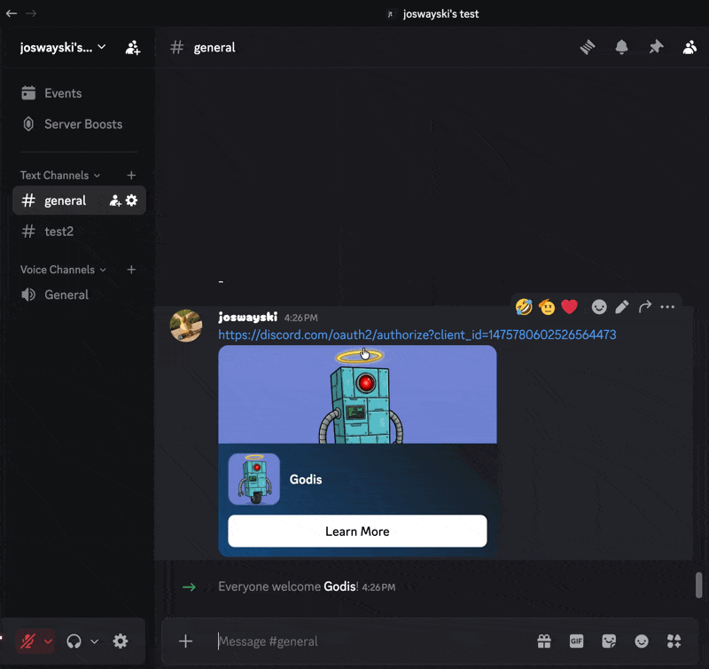
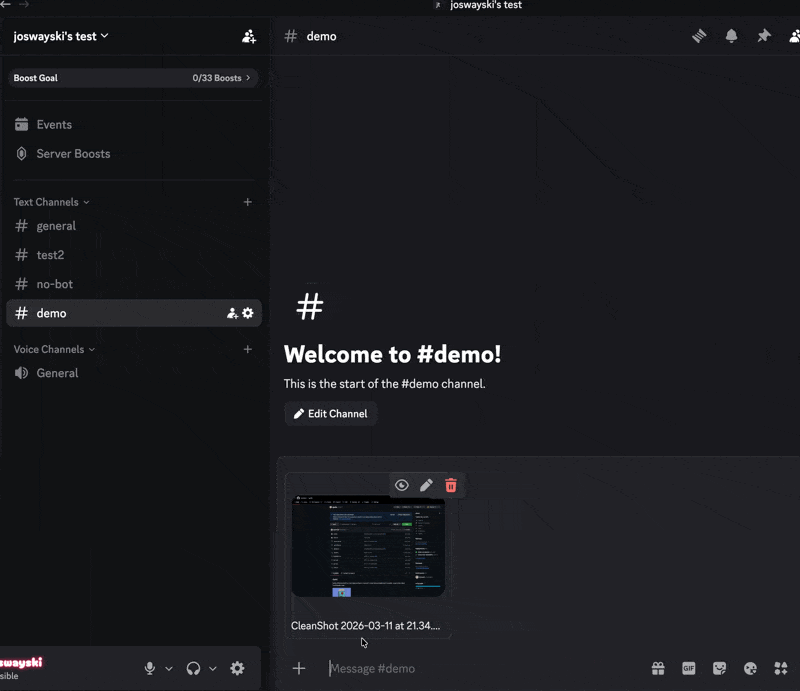
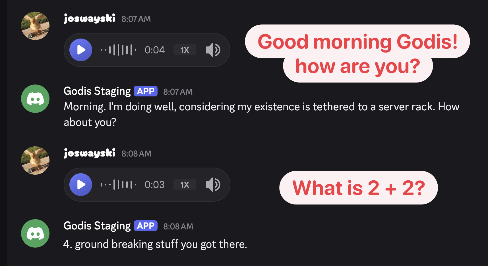

### Godis

Helpful Discord bot! Replaces social media links with embeddable versions and has AI-powered chat capabilities.


### Features

#### Link Replacements

Automatically replaces social media links so that video/image embeds render properly in Discord. The original message is deleted and re-posted via webhook, preserving the author's name and avatar.

- `twitter.com` and `x.com` -> `vxtwitter.com`  
- `facebook.com` (share/reel links) -> `facebed.com`  
- `instagram.com` (posts/reels/stories) -> `eeinstagram.com`



#### AI Chat (WIP)

Godis can read and respond to messages using any OpenAI-compatible API (e.g. OpenRouter). AI features are opt-in by specifying the `AI_ALLOWED_SERVERS` or `AI_ALLOWED_CHANNELS` variables.

On each message that we receive, we pass in the last N (`AI_NUMBER_OF_MESSAGES_IN_HISTORY`) number of messages in the channel as context for the request. Responses can be customized via the system prompt (`AI_SYSTEM_PROMPT`). It is ideal to tweak this so that Godis does not reply to every message and the replies are relevant to the conversation.

Godis has a typing indicator with some jitter before responding for a more natural feel. Godis also gets the context from embedded links, and can even read files, images, and audio. 

See [.env.example](.env.example) for all of the available parameters.





TODO update image capabilities

### Prerequisites
A `DISCORD_TOKEN` for a bot with the following:

- #### Scopes
    - applications.commands
    - bot
- #### Permissions
    - Manage Messages
    - Manage Webhooks
    - Send Messages
- #### Message Content Intent
    - This needs to be enabled at https://discord.com/developers/applications/YOUR_BOT_ID/bot


### Running

Create a `.env` file at the root (see `.env.example`), then `go run .`
```bash
{"time":"2026-03-05T23:40:42.338935+03:00","level":"INFO","msg":"Godis is starting..."}
{"time":"2026-03-05T23:40:44.818278+03:00","level":"INFO","msg":"Godis is ready waiting for messages!"}
```


### Future

I'd like for it to handle audio well (inputs) and also reply with voice. I want it to be able to set reminders on a schedule, and even have long term memory per channel / server to remember things about you / your friends.
